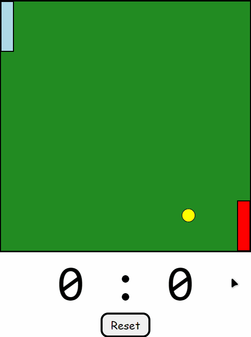

# PingPongGame
Esse minigame foi feito utilizando, somente HTML, CSS e JavaScript.

Utilizei esse projeto de PingPongGame para aplicar alguns conceitos práticos para aperfeiçoar meu Javascript

O jogador da esquerda se movimenta com: "W" e "S", e o jogador da direita com: "Up" e "Down"

Aproveite e se divirta
#
This minigame was made using only HTML, CSS and JavaScript.

I used this PingPongGame project to apply some practical concepts to improve my Javascript

The player on the left moves with: "W" and "S", and the player on the right with: "Up" and "Down"

Enjoy and have fun

## :camera_flash: PingPongGame GIF

    

