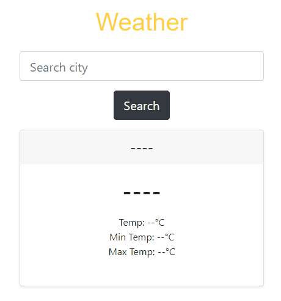

# WeatherAPI

Esse website foi feito utilizando HTML, CSS, JavaScript e Bootstrap, utilizando uma API de clima ja existente do google.

Utilizei esse projeto de WeatherAPI para aplicar alguns conceitos práticos de Bootstrap, Fetch, e requisições API.
#

This website was made using HTML, CSS, JavaScript and Bootstrap, using an existing google weather API.

I used this WeatherAPI project to apply some practical concepts of Bootstrap, Fetch, and API requests.

## :camera_flash: WeatherAPI GIF

